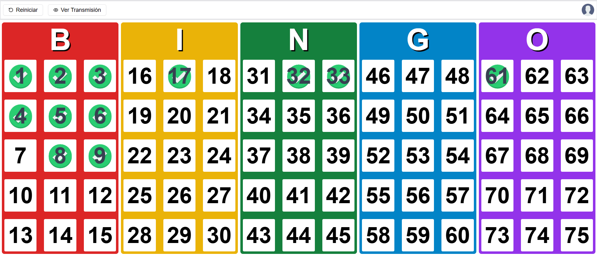

# Bingo Web

Aplicación para proyectar el juego del bingo desde un panel con autorización.

## Tecnologías
<table align="center">
  <tr>
    <td align="center">
      <a href="https://www.typescriptlang.org/">
         
        TypeScript
      </a>
    </td>
    <td align="center">
      <a href="https://nextjs.org/">
         
        Next.js
      </a>
    </td>
    <td align="center">
      <a href="https://tailwindcss.com/">
       
        Tailwind
      </a>
    </td> 
    <td align="center">
      <a href="https://ui.shadcn.com/">
       
        Shadcn/UI
      </a>
    </td>   
    <td align="center">
      <a href="https://firebase.google.com/">
       
        Firebase
      </a>
    </td> 
  </tr>
</table>

## Capturas

### Control

### Visualizador
